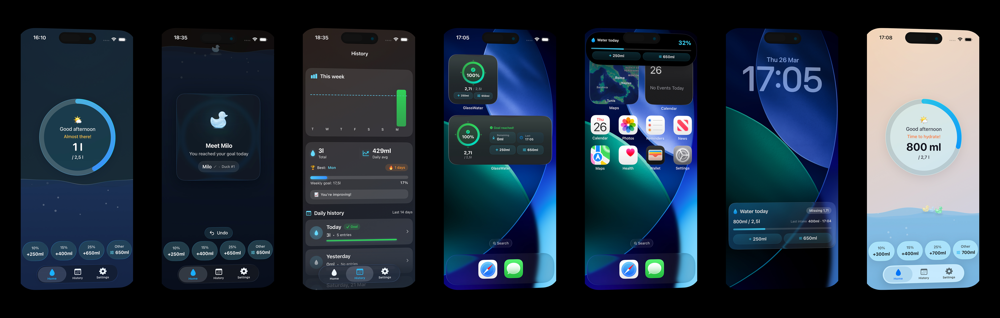
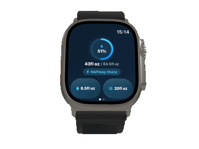

# GlassWater

Hydration tracking for iOS 26+, watchOS, and widgets.

Built with SwiftUI, SwiftData, HealthKit, and Liquid Glass design.

[Available on the App Store](https://apps.apple.com/app/id6757977655)

<p align="center">
  
</p>

<p align="center">
  
  
</p>

## Architecture

**MVVM with Protocol-Based Dependency Injection**

`AppServices` holds 14 protocol-typed dependencies injected at launch. Every ViewModel receives only the services it needs. `PreviewServices` provides a full mock graph for Xcode Previews with zero backend dependency.

**Data flow:**

```
User action → @Observable ViewModel → Services → SwiftData (source of truth)
     ↓
AppGroup JSON → Widgets + Live Activity
     ↓
Darwin Notifications + WatchConnectivity → all surfaces sync
     ↓
HealthKit (bidirectional, best-effort)
```

## Key Engineering Decisions

**Why SwiftData over Core Data?**
SwiftData integrates natively with `@Observable` and `@Model`, eliminating boilerplate. CloudKit sync comes free. The trade-off is iOS 17+ minimum, but since GlassWater targets iOS 26+, this was a clear win.

**Why 4-layer storage fallback?**
CloudKit sync can fail silently (iCloud disabled, quota exceeded, network issues). Rather than crash or lose data, `ModelContainerFactory` chains AppGroup → CloudKit → Local → In-memory. The app degrades gracefully. Users never notice.

**Why 5 independent day-rollover mechanisms?**
A single midnight reset via `Timer` fails when the app is suspended. Background tasks are not guaranteed. Widget timelines can be delayed. No single mechanism is reliable, so the system uses all five: system time-change notification, background task, widget timeline entry, Live Activity day-change detection, and intent stale-date check. If any one fires, the day resets correctly.

**Why Darwin Notifications for cross-surface sync?**
Widgets, Live Activities, and the main app run in separate processes. `NotificationCenter` doesn't cross process boundaries. Darwin notifications are the lightest IPC mechanism available on iOS, with zero serialization overhead. Combined with AppGroup for data sharing, this keeps all surfaces in sync within milliseconds.

**Why bidirectional HealthKit sync?**
Users expect water logged in Apple Health to appear in GlassWater and vice versa. Each entry carries an optional `healthSampleId: UUID` for deduplication. A 60-second grace period prevents double-counting during rapid edits. Observer queries reconcile new and deleted samples.

**Side-effects centralization.** `applyMutationSideEffects()` with `RefreshSource` enum guarantees streak calculation, duck rewards, and celebration triggers run consistently regardless of entry source.

## Design

- **Liquid Glass.** 100% `.glassEffect()` on navigation chrome, never on content. No legacy materials.
- **Time-of-day backgrounds.** Gradient adapts to morning, day, evening, and night.
- **Spring-only animations.** `.spring(.smooth)` for transitions, `.spring(.bouncy)` for touch feedback, `.spring(.snappy)` for quick actions. No `.linear` or `.easeInOut`.
- **Haptic feedback** on every interaction.

## Project Structure

```
GlassWater/                  # Main iOS app
├── App/                     # Entry point, AppDelegate
├── ViewModels/              # 5 @Observable view models
├── Views/                   # SwiftUI views + 15 reusable components
├── Services/                # 24 protocol-based services
├── Domain/                  # Pure logic (calculators, formatters)
├── Extensions/              # Design system (colors, fonts, helpers)
└── Resources/               # 7 languages (EN, PT, ES, FR, IT, DE, RU)

Shared/                      # 31 files shared across all 4 targets
├── Models/                  # WaterEntry, UserSettings (@Model)
├── Stores/                  # SwiftData persistence
├── Services/                # Factories, sync coordinators
├── Intents/                 # Siri + widget quick-add buttons
└── Constants/               # App-wide configuration

GlassWaterTests/             # 30 test files
GlassWaterWidgetExtension/   # 5 widget families + Live Activity
GlassWaterWatchApp/          # watchOS companion
```

## Tech Stack

| | |
|-|-|
| **UI** | SwiftUI, @Observable, Liquid Glass (.glassEffect) |
| **Data** | SwiftData, CloudKit, AppGroup |
| **Health** | HealthKit (bidirectional sync) |
| **Surfaces** | 5 widget families, Live Activities, Dynamic Island, Watch app |
| **Intents** | App Intents (Siri shortcuts, widget buttons) |
| **Sync** | Darwin Notifications, WatchConnectivity, AppGroup |
| **Analytics** | Firebase Crashlytics (privacy-first, no ads, no tracking) |
| **Testing** | XCTest, 30 test files covering ViewModels, Domain, and Services |
| **Minimum** | iOS 26+, watchOS 26+ |

## Setup

1. Clone the repository
2. Add your `GoogleService-Info.plist` to `GlassWater/` (see the `.plist` file for the expected structure with placeholder values)
3. Open `GlassWater.xcodeproj` in Xcode 26+
4. Build and run

## Notes

This is the source code for a published App Store product. Firebase credentials have been replaced with placeholders for public access.

---

Built by [Felipe Canhameiro](https://github.com/fecanhameiro) at [Prism Labs](https://prismlabs.studio).
